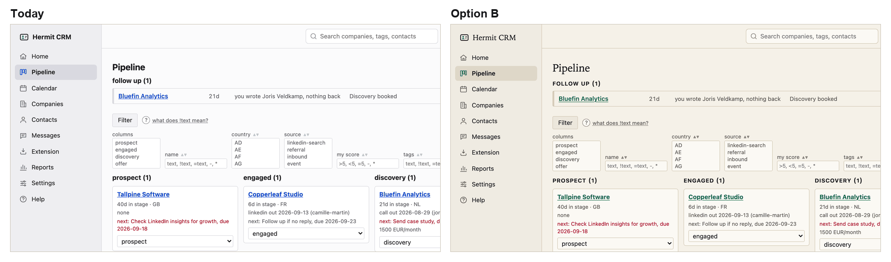
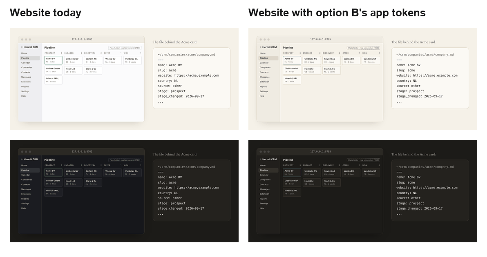
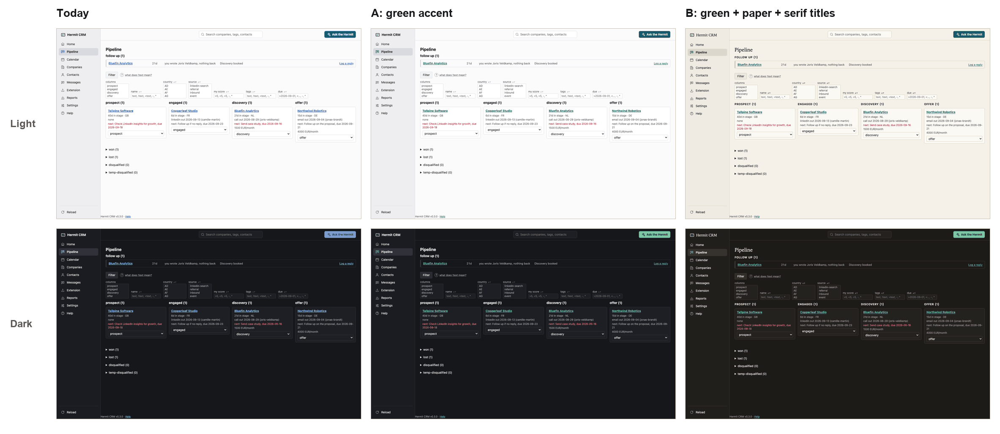
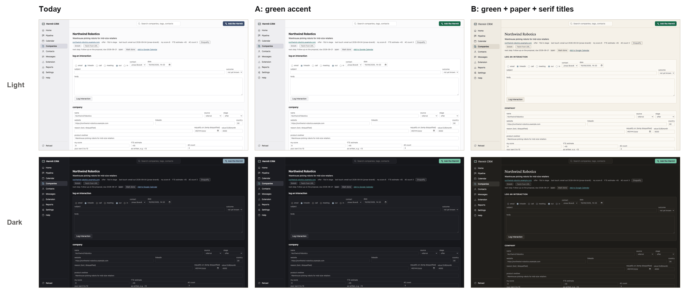
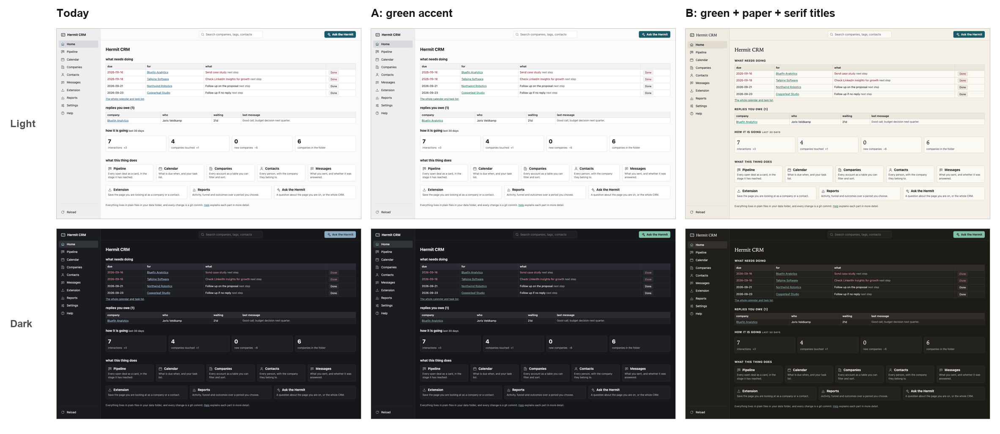

# The app takes the website's look

Proposal of 2026-09-19. Status: **decided and built the same day: option B**, now the
default. Where the build differs from this text (one added token, `--title-font`, and
the field borders), the plan says why:
[`../plans/2026-09-19-app-site-look.md`](../plans/2026-09-19-app-site-look.md).
The pictures, the two preview themes and the script
behind every colour and contrast figure are in
[`2026-09-19-app-site-look/`](2026-09-19-app-site-look/).

## In short

- The app and the website already share their foundations: one `tokens.css`, the
  logo, the brand green, the font stacks, and a website build that fails if the two
  drift apart. They do not share a look. The app is cool grey with a blue accent and
  sans titles; the website is warm paper with the logo green and serif type. A visitor
  downloads from a cream, green, serif page and opens a grey and blue app.
- **Recommendation: option B.** The app takes the website's green as its accent, the
  website's paper colours in light and dark, and its serif for titles. Everything you
  work in (the board, tables, forms, all 12 to 14px text) stays in the system sans at
  today's size and density. No layout or template changes.
- It is a small change: 16 values in `tokens.css`, 7 rules in `style.css`, 2 rules in
  the website's drawing of the app. No token is renamed, so every user's
  `theme.css` keeps working.
- It replaces decision D0 of 18 Sep ("the app stays blue"). It also fixes a rule the
  app breaks today: input borders are 1.7:1, and `DESIGN.md` asks for 3:1.
- You can try B before deciding, without code: put
  [`theme-B.css`](2026-09-19-app-site-look/theme-B.css) in your data folder as
  `theme.css`. Delete the file to go back.



## How we got here

1. **18 Sep, website session.** After building the site, Claude asked: "Accent colour:
   should the app move to the logo green, or should the site move to the app's blue?
   I'd lean towards green in the app, since the logo is green."
2. **The answer was "remain on green".** The design review recorded it as
   **D0: "Site stays logo green; app stays blue. Neither changes."** and put "App accent
   colour change" under "NOT in scope"
   (`~/.gstack/projects/Hermit-CRM-hermit-crm/designs/website-review-20260918/PLAN.md`).
   The question was not asked again.
3. **Same review, on drift:** "I don't want the designs of the website and app to drift
   apart." That became PR #17 (fd8a0f5): the shared `tokens.css`, `theme.css` for users,
   and the drift check in `website/build.py`. `DESIGN.md` then wrote that the two looks
   "differ on purpose".

So the plumbing is aligned and the look is not. There is no earlier proposal for the look.
Checked: the repo on every branch, PRs #1 to #20, GitHub issues, `TODO.md`, `DESIGN.md`,
the gstack plans, and earlier Claude sessions. If "remain on green" meant green
everywhere, option A is what D0 should have said.

## What differs today

| | App | Website |
|---|---|---|
| Accent | blue `#1a4fd6` (dark `#7ea6ff`) | logo green: links `#166B4A` (dark `#6BC49A`), fills `#1E8A60` |
| Neutrals | cool grey: page `#fbfbfc`, cards `#ffffff`, sidebar `#eeeef1` | warm paper: page `#F5F1E8`, cards `#FBF9F4`, rules `#D2C8B4` |
| Dark mode | cool blue-black, page `#16171b` | warm dark paper, page `#1C1B18` |
| Titles | system sans, 20px, bold | serif (New York in Safari, Iowan Old Style in Chrome, Georgia on Windows), regular weight |
| Section labels | lowercase sans, 15px | small caps, letter-spaced |
| Body text | system sans, 14px | serif, 19px |
| Keyboard focus | the browser's own ring (blue) | 2px ring in the link green |
| Input borders | 1.7:1, below the 3:1 in `DESIGN.md` | 3.4:1 (the Copy button) |
| Already shared | logo mark, `--brand` `#1E8A60`, `--ink`, `--sans`, `--mono`, `--serif`, `tokens.css` | the same |

The website shows the mismatch itself. Its drawing of the app reads the app's tokens,
so in dark mode it is a cool blue-black window on warm paper:



## Options

### A. Green accent

Only what is blue today turns green. `--accent` becomes the website's link green
(`#166B4A`, dark `#6BC49A`). The info tint that flash messages and today's cell in the
calendar use follows it. Keyboard focus gets a 2px ring in the accent instead of the
browser's blue.

- **For:** 3 tokens and 1 rule. Links, the Ask button, badges, the active menu icon and
  the focus ring match the logo.
- **Against:** still a cool grey app with sans titles beside a warm serif website, and the
  website's drawing of the app still looks out of place on its page.

Why not the logo green itself (`#1E8A60`) as the accent? It is 4.3:1 on white, below AA
for the app's 12 to 14px links and for the white text on the Ask button. The website uses
`#1E8A60` only for its large Download button and `#166B4A` for links.

### B. Green, paper and serif titles (recommended)

A, plus:

- **Colours:** the website's paper palette for every neutral, in light and dark. Where the
  website has a value it is used as it is (see "The change").
- **Titles:** page titles (`h1`), the sidebar wordmark and the numbers on Home in the
  website's serif, at 24px and not bold.
- **Section labels:** `h2` in small caps like the website's labels, instead of lowercase.
- **Input borders:** the website's control border, 3.4:1, which also meets `DESIGN.md`.
- **Links:** underlined like the website's, 1px and slightly below the text.

Unchanged: layout, spacing, density, the 14px sans for everything you work in, icons,
components, and the red, amber and green of errors, warnings and success.

- **For:** one product from the download page to the app. The website's drawing matches
  its page. Still a change of values, not of structure.
- **Against:** the largest visible change to a tool you use every day (cream instead of
  white). The serif looks slightly different per browser, exactly as on the website.







### C. Full Quiet cabin (not recommended)

Serif body text, the website's type sizes and spacing, 14px rounded cards, a reading
column.

The app is a working tool: a board, tables with filters, a calendar, forms. Serif at 12 to
14px in tables and forms reads worse on ordinary screens. The website's spacing would
roughly halve what fits on a screen, and the change means rewriting most of the 573 lines
of `style.css` with a real risk of breaking pages. The website is a quiet page about a
working tool; the tool should stay a tool. A narrow idea for later: the Help pages, which
are long reading, in the website's serif body text.

## Recommendation

B, tried first and built in the build week (5 to 9 Oct):

1. **Now:** use `theme-B.css` as the `theme.css` of your own data folder for the two weeks
   of real use. It changes only your own app, involves no code, and deleting the file
   undoes it. This fits "use before publishing": you find out whether cream and serif
   titles work on a busy morning before anyone else sees them.
2. **Build week:** if it holds up, make it the default in one PR (next section). Any part
   you dislike (the small caps, the darker input borders) can be dropped on its own.

## The change (option B)

### Tokens: `src/hermitcrm/static/tokens.css`

| Token | Today light | B light | Today dark | B dark | From |
|---|---|---|---|---|---|
| `--accent` | `#1a4fd6` | `#166B4A` | `#7ea6ff` | `#6BC49A` | site `--green-ink` |
| `--info-bg` | `#eef4ff` | `#E4EBE3` | `#1d2a44` | `#2D352D` | accent over the card, 10-12% |
| `--info-line` | `#c7d8ff` | `#B6CEC1` | `#2f4675` | `#395343` | accent over the card, 30% |
| `--bg` | `#fbfbfc` | `#F5F1E8` | `#16171b` | `#1C1B18` | site `--paper` |
| `--surface` | `#ffffff` | `#FBF9F4` | `#1e1f24` | `#24221E` | site `--card` |
| `--surface-2` | `#f7f7f9` | `#F2EEE6` | `#23242a` | `#292723` | step between card and subtle |
| `--subtle` | `#f2f2f5` | `#ECE7DC` | `#2a2b32` | `#302D28` | step between paper and window bar |
| `--text` | `#1b1b1f` | `#17181A` | `#e6e6ea` | `#ECE7DC` | site `--text` (`--ink`) |
| `--muted` | `#5c5c66` | `#5C574E` | `#a4a4ae` | `#A8A193` | site `--muted` |
| `--faint` | `#8e8e98` | `#8F8778` | `#7c7c86` | `#7A7264` | site `--copy-border` |
| `--line` | `#d9d9de` | `#D2C8B4` | `#34353d` | `#3F3A33` | site `--rule` |
| `--line-strong` | `#c4c4cc` | `#8F8778` | `#44454e` | `#7A7264` | site `--copy-border` (3:1 for controls) |
| `--sidebar` | `#eeeef1` | `#EFEBE2` | `#1b1c21` | `#211F1C` | light: site `--window-bar` |
| `--sidebar-hover` | `#e2e2e7` | `#E7E1D5` | `#26272e` | `#2B2924` | dark: site `--window-bar` |
| `--sidebar-active` | `#d9d9e0` | `#DED7C8` | `#30313a` | `#35322C` | one step darker (light) or lighter (dark) |

`--shadow-color` becomes a warm `rgba(40, 32, 20, .16)` in light and stays
`rgba(0, 0, 0, .5)` in dark. The `@supports` fallback block gets the light values.
`--danger`, the error, warning and success tokens, `--brand`, `--ink` and the font stacks
do not change. The values are in [`palettes.py`](2026-09-19-app-site-look/palettes.py),
which also prints the contrast table below.

### Rules: `src/hermitcrm/static/style.css`

These replace today's `h1`, `h2` and `a` rules in place. The other four are new.

```css
h1 { font-family: var(--serif); font-size: 24px; font-weight: 500; letter-spacing: -.005em; margin: 10px 0 6px; }
h2 { font-size: 15px; margin: 22px 0 8px; font-weight: 600; font-variant-caps: all-small-caps; letter-spacing: .06em; }
a { color: var(--accent); text-decoration-thickness: 1px; text-underline-offset: 2px; }
:focus-visible { outline: 2px solid var(--accent); outline-offset: 2px; }
nav.sidebar .brand span { font-family: var(--serif); font-size: 17px; font-weight: 500; }
.start-cards.numbers .card h3 { font-family: var(--serif); font-weight: 500; font-variant-numeric: lining-nums; }
/* h2s that are subtitles rather than labels */
.month-nav h2, .setup-step h2, .helpdoc h2, .feedback-saved h2, .welcome-step h2 { font-variant-caps: normal; letter-spacing: 0; }
```

Those five subtitle rules already set `text-transform: none`, which becomes redundant once
`h2` is no longer lowercase and can go. `.helpdoc h1` keeps its 20px.

### The website: `website/site/style.css`

The drawing of the app follows the new colours by itself, because the build copies
`tokens.css`. Two rules follow the new titles: `.mock-title` and `.mock-brand` get
`font-family: var(--serif)`. The share image `og.png` has no drawing of the app in it, so it
stays as it is.

### Other files

- **`DESIGN.md`:** "The two looks" becomes one look at two densities: the same palette,
  accent and title type everywhere; the app sets what you work in in sans, the website sets
  what you read in serif. D0 is replaced.
- **Help > Settings and `usertheme.EXAMPLE`:** the example `theme.css` sets a green accent,
  which becomes the default. The example should show the old blue instead
  (`light-dark(#1a4fd6, #7ea6ff)`), so anyone who preferred it is one line away.
- **`CHANGELOG.md`:** one entry.
- **In passing:** `docs/ARCHITECTURE.md:236` still says "no dark mode needed".

## Contrast

WCAG contrast of every pair that carries text or marks a control, from `palettes.py`.
Minimum 4.5 for text, 3.0 for focus rings, control borders and non-essential hints.

| Pair | Min | Today light | A light | B light | Today dark | A dark | B dark |
|---|---|---|---|---|---|---|---|
| body text: `--text` on `--bg` | 4.5 | 16.60 | 16.60 | 15.76 | 14.39 | 14.39 | 13.97 |
| text on cards, tables, inputs: `--text` on `--surface` | 4.5 | 17.17 | 17.17 | 16.89 | 13.22 | 13.22 | 12.88 |
| active menu item: `--text` on `--sidebar-active` | 4.5 | 12.22 | 12.22 | 12.40 | 10.38 | 10.38 | 10.36 |
| flash message: `--text` on `--info-bg` | 4.5 | 15.55 | 14.81 | 14.63 | 11.50 | 10.51 | 10.27 |
| 12px secondary text: `--muted` on `--bg` | 4.5 | 6.39 | 6.39 | 6.36 | 7.25 | 7.25 | 6.71 |
| 12px secondary text on cards: `--muted` on `--surface` | 4.5 | 6.61 | 6.61 | 6.82 | 6.66 | 6.66 | 6.19 |
| menu icons, sidebar notes: `--muted` on `--sidebar` | 4.5 | 5.71 | 5.71 | 6.03 | 6.88 | 6.88 | 6.41 |
| hints, placeholders (non-essential): `--faint` on `--surface` | 3.0 | 3.24 | 3.24 | 3.38 | 3.98 | 3.98 | 3.34 |
| links: `--accent` on `--bg` | 4.5 | 6.48 | 6.28 | 5.76 | 7.49 | 8.52 | 8.19 |
| links on cards: `--accent` on `--surface` | 4.5 | 6.70 | 6.49 | 6.17 | 6.88 | 7.82 | 7.55 |
| link inside a flash message: `--accent` on `--info-bg` | 4.5 | 6.07 | 5.60 | 5.34 | 5.99 | 6.22 | 6.02 |
| Ask button, badge text: `--surface` on `--accent` | 4.5 | 6.70 | 6.49 | 6.17 | 6.88 | 7.82 | 7.55 |
| focus ring against a card: `--accent` on `--surface` | 3.0 | 6.70 | 6.49 | 6.17 | 6.88 | 7.82 | 7.55 |
| input and select borders: `--line-strong` on `--surface` | 3.0 | 1.73 ✗ | 1.73 ✗ | 3.38 | 1.73 ✗ | 1.73 ✗ | 3.34 |
| errors, overdue: `--danger` on `--surface` | 4.5 | 7.33 | 7.33 | 6.96 | 6.58 | 6.58 | 6.35 |
| won / successful: `--ok` on `--surface` | 4.5 | 5.07 | 5.07 | 4.81 | 8.84 | 8.84 | 8.54 |
| warning text: `--warn` on `--warn-bg` | 4.5 | 5.89 | 5.89 | 5.89 | 8.56 | 8.56 | 8.56 |

Every text pair passes in all three looks. The only failure is today's, and B's input
borders fix it.

## How the pictures were made

The installed app (main at b83a372) served a copy of the fictional demo folder
(`hermitcrm init --demo`) on port 8791, with Appearance set to follow the system.
Chromium at 1440 x 900 captured Home, Pipeline and a company page in light and dark,
first with no `theme.css`, then with `theme-A.css`, then with `theme-B.css`, all
applied the way a user would. There were no console errors, and the measured styles
matched the themes (accent colour, page colour, serif `h1` at 24px). The website
picture comes from two scratch builds of `website/`: one with today's `tokens.css`,
one with B's values.
Chrome shows Iowan Old Style for the titles; Safari shows New York.

## Checks for the implementation PR

- `.venv/bin/pytest`, including `tests/test_tokens.py` (every `var()` defined, every colour
  `light-dark()`, the fallback complete).
- `python3 palettes.py`: every pair at or above its minimum, light and dark.
- Before and after screenshots of Home, Pipeline, a company, Calendar (today's cell),
  Settings (a flash message) and Help, light and dark, at 1440 and 390px wide.
- `python3 website/build.py` passes, and the drawing renders in light and dark.
- One look in Safari (New York) and one in Chrome (Iowan Old Style).
- Your check, about 2 minutes: Pipeline and a company page in light and dark, then press
  Tab once to see the focus ring.

## Does this change what's live, your data, or anything public?

- **This proposal:** no. It is a document on a local branch.
- **Trying B:** only the look of your own app, through one file in your data folder that
  you can delete.
- **The PR:** the default look of the app, for you after deploy and for testers after an
  update. No data migration, no change in behaviour. The website draft's drawing changes
  colour at its next build; nothing is public before 19 Oct.

## Decisions for you

1. **Which look:** B (recommended), A, or today's (D0 stands)?
2. **Try it first:** use `theme-B.css` as your own `theme.css` for the two weeks of use?
3. **When:** build it in the build week (5 to 9 Oct), or earlier?

To try B from the branch without checking it out:

```sh
git -C ~/Code/HermitCRM show spec-app-site-look:docs/superpowers/specs/2026-09-19-app-site-look/theme-B.css > ~/Code/CRM/theme.css
```

Delete `~/Code/CRM/theme.css` to go back. Settings > Appearance shows whether a theme is
in use.
